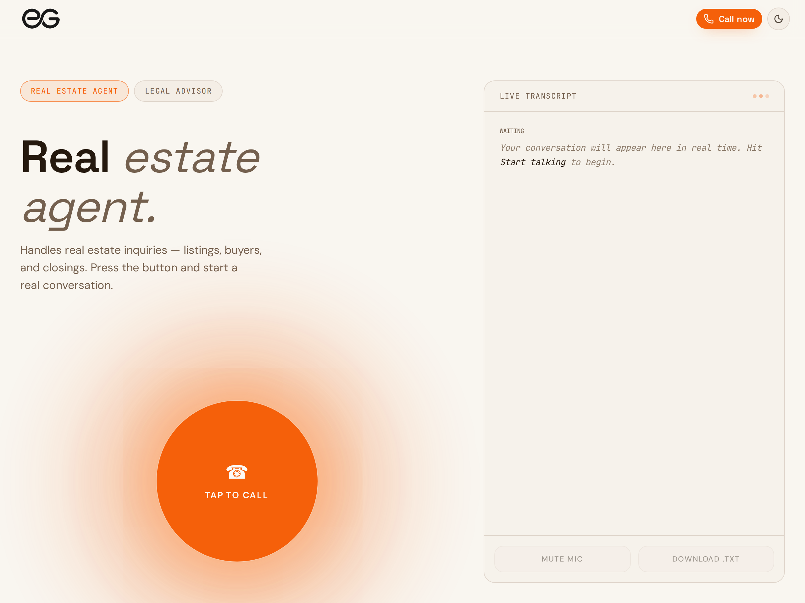

# easeGrow AI voice demo

A browser demo of easeGrow AI's voice agents. Pick an assistant, tap to talk, and have a real voice
conversation without installing anything.

**Live:** [voice.tryeasegrow.com](https://voice.tryeasegrow.com)



## How it works

- **Voice calls:** the [Vapi](https://vapi.ai) Web SDK runs the call in the browser. There are two
  assistants: a Real Estate Agent and a Legal Advisor.
- **One call at a time:** a lock shared across browser tabs stops a second tab from starting a call
  while one is live.
- **Rate limit:** before a call starts, a TanStack Start server function records it in a Supabase
  table and allows 3 calls per IP address every 15 minutes. Row-level security keeps the table closed to
  everyone except the server.
- **Errors:** if server rendering fails, visitors see a simple error page instead of a raw error response.

## Tech stack

TanStack Start (React 19, Vite, Nitro), Tailwind CSS 4, Supabase and the Vapi Web SDK.

## Run it locally

Requires Node.js 22 or later.

```sh
npm install
cp .env.example .env   # then fill in the values
npm run dev            # http://localhost:8080
```

| Variable                    | What it's for                                                   |
| --------------------------- | --------------------------------------------------------------- |
| `SUPABASE_URL`              | Server only. The Supabase project that stores the rate limit.   |
| `SUPABASE_SERVICE_ROLE_KEY` | Server only. Never expose it to the browser.                    |
| `VITE_VAPI_PUBLIC_KEY`      | Optional. Overrides the public key in `src/lib/vapi-config.ts`. |

The `call_rate_limits` table comes from the migration in `supabase/migrations/`.

## Scripts

| Command          | What it does                  |
| ---------------- | ----------------------------- |
| `npm run dev`    | Start the dev server          |
| `npm run build`  | Production build              |
| `npm run lint`   | Run ESLint (with Prettier)    |
| `npm run format` | Format the code with Prettier |
